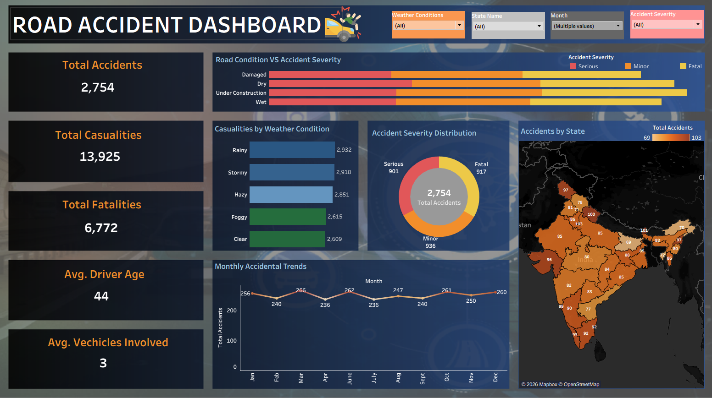

# Road Accident Dashboard – Tableau Project

## Project Overview
This project is an interactive **Road Accident Dashboard** created in **Tableau** to analyze road accident trends, casualties, fatalities, and accident severity across different states and environmental conditions.

The dashboard helps stakeholders and analysts understand:

- Total accident trends
- Casualty and fatality analysis
- Road condition impact on accidents
- Weather condition analysis
- Accident severity distribution
- State-wise accident patterns
- Monthly accident trends

The objective of this dashboard is to provide data-driven insights that can support road safety improvements and accident prevention strategies.

## Dashboard Preview

## Key KPIs

| KPI | Value |
|------|------|
| Total Accidents | 3,000 |
| Total Casualties | 15,198 |
| Total Fatalities | 7,366 |
| Average Driver Age | 44 |
| Average Vehicles Involved | 3 |

## Features & Insights

### Road Condition vs Accident Severity
- Displays accident severity across various road conditions:
  - Wet
  - Dry
  - Damaged
  - Under Construction
- Helps identify road conditions associated with higher accident severity.

### Casualties by Weather Condition
- Analyzes casualties under different weather conditions:
  - Rainy
  - Stormy
  - Hazy
  - Foggy
  - Clear
- Useful for understanding weather-related accident risks.

### Accident Severity Distribution
- Visualizes the distribution of:
  - Minor Accidents
  - Serious Accidents
  - Fatal Accidents
- Helps evaluate the impact level of accidents.

### State-wise Accident Analysis
- Interactive geographical map showing accident distribution across Indian states.
- Helps identify high accident-prone regions.

### Monthly Accidental Trends
- Displays monthly fluctuations in accident occurrences throughout the year.
- Useful for identifying seasonal trends and accident patterns.

### Interactive Filters
- Dynamic filtering using:
  - Weather Conditions
  - State Name
  - Month
  - Accident Severity
- Enables users to perform customized and interactive analysis.

## Tools & Technologies Used

- Tableau
- Microsoft Excel / CSV Dataset
- Data Visualization
- Dashboard Design

## Skills Demonstrated

- Data Cleaning
- KPI Analysis
- Interactive Dashboard Development
- Trend Analysis
- Data Visualization
- Business Insights Generation

## Business Problem

Road accidents can result in:
- Loss of human lives
- Increased medical and emergency costs
- Traffic congestion
- Economic losses

This dashboard helps stakeholders identify:
- High-risk environmental conditions
- Accident-prone states
- Severity distribution patterns
- Monthly accident fluctuations

## Conclusion

The Road Accident Dashboard provides a comprehensive overview of accident patterns, contributing factors, and severity distribution. It enables analysts and decision-makers to derive actionable insights that can support road safety planning and accident reduction initiatives.
